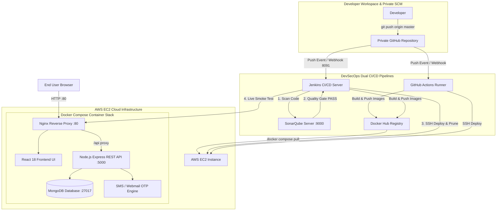

# 🎬 Netflix Full-Stack Application & DevSecOps CI/CD Pipeline

A production-grade, full-stack **Netflix Clone** built for **DevOps, DevSecOps Engineering & Cloud Architecture Practice**. This project features multi-stage Docker containerization, AWS EC2 Cloud Deployment, SonarQube SAST Code Quality Gates, Live Smoke Testing, and a **Dual CI/CD Pipeline Architecture** running **Jenkins** (with GitHub Webhooks) and **GitHub Actions** in parallel.

---

## 🏗️ System Architecture



---

## 🛠️ Technology Stack & Core Features

### **Frontend & UI**
* **Framework:** React 18, Vite, Vanilla CSS Design System.
* **UI Features:** Netflix Dark Theme, Glassmorphism, dynamic movie catalog, responsive navigation, live password strength checker, numeric-only mobile validation.
* **Authentication:** Multi-provider authentication supporting Email/Password with JWT and **Google Firebase OAuth ("Continue with Google")**.
* **Web Server:** Nginx (serving static production build & reverse-proxying `/api` requests to Express backend).

### **Backend & Authentication**
* **Runtime:** Node.js, Express.js REST API.
* **Authentication & Identity:** JWT (JSON Web Tokens), bcrypt password encryption, Firebase Auth token verification.
* **OTP Engine:** Dynamic SMS dispatch (Fast2SMS / Twilio) with fallback to virtual webmail preview.
* **Database & Persistence:** MongoDB persistence for Users, Movies, and Profile-isolated Watchlists.

### **DevOps, DevSecOps & Cloud Infrastructure**
* **Containerization:** Multi-stage `Dockerfile` builds for optimized lightweight images (`node:18-alpine`, `nginx:alpine`).
* **Container Security:** Hardened Docker network bindings to isolate internal service ports (MongoDB, Express) behind Nginx reverse proxy.
* **Code Security & Quality (SAST):** SonarQube Server & SonarScanner CLI with Quality Gate verification.
* **Orchestration:** `docker-compose.yml` coordinating MongoDB, Express Backend, and Nginx Frontend.
* **Cloud Hosting:** AWS EC2 Instance (Amazon Linux 2023 / Ubuntu Server).

---

## 🔄 Dual CI/CD Pipeline & DevSecOps Stages

### 1. 🔴 Jenkins Pipeline (`Jenkinsfile`)
Executes 6 automated stages on every `git push`:
1. **Checkout Code**: Securely authenticates with private GitHub repositories using GitHub PAT (`github-tocken`).
2. **SonarQube Code Quality & Quality Gate**: Scans JavaScript/React source code for bugs, code smells, and security vulnerabilities via SonarQube Server (`http://<EC2-IP>:9000`).
3. **Build Docker Images**: Builds frontend & backend images with `--no-cache` to ensure clean builds.
4. **Push to Docker Hub**: Authenticates and pushes tagged images to Docker Hub (`sathiyananth/netflix-frontend`, `sathiyananth/netflix-backend`).
5. **Deploy to EC2 Instance**: SSHs into EC2, purges old container cache, pulls fresh images, and restarts the stack (`docker compose up -d --force-recreate`).
6. **Live Application Smoke Test**: Automatically executes HTTP curl health checks on `http://<EC2-IP>/` (Frontend 200 OK) and `http://<EC2-IP>/api/health` (Express API Health Endpoint) before passing the build.

### 2. 🤖 GitHub Actions Pipeline (`.github/workflows/deploy.yml`)
* Runs in parallel on GitHub cloud runners.
* Logins to Docker Hub, builds multi-stage images, pushes `latest` tags, and deploys via SSH action.

---

## 🚀 Quick Start Guide

### 1. Local Development (Without Docker)

#### Backend Setup
```bash
cd backend
npm install
npm run seed     # Seed database with sample movie catalog & demo user
npm start        # Starts Express server on http://localhost:5000
```

#### Frontend Setup
```bash
cd frontend
npm install
npm run dev      # Starts Vite dev server on http://localhost:3000
```

#### 🔑 Demo Credentials
* **Email:** `devops@netflix.com`
* **Password:** `devops123`

---

### 2. Local Container Deployment (Docker Compose)

Spin up the entire application stack (MongoDB + Backend + Frontend/Nginx) with one command:

```bash
docker compose up --build -d
```

#### Verification
* **Frontend Application:** `http://localhost:80` or `http://localhost:8080`
* **Backend Health Check:** `http://localhost:5000/api/health`
* **Check Container Status:** `docker compose ps`

---

## 🌐 AWS EC2 Cloud Deployment & Firewall Rules

### Security Group Inbound Rules

Ensure your AWS EC2 Instance Security Group has the following **Inbound Rules**:

| Type | Protocol | Port Range | Source | Purpose |
|---|---|---|---|---|
| **HTTP** | TCP | `80` | `0.0.0.0/0` | Public Web App Access |
| **SSH** | TCP | `22` | `0.0.0.0/0` | Remote Terminal & CI/CD Deployment |
| **Custom TCP** | TCP | `5000` | `0.0.0.0/0` | Express REST API |
| **Custom TCP** | TCP | `8091` | `0.0.0.0/0` | Jenkins Dashboard & Webhook Endpoint |
| **Custom TCP** | TCP | `9000` | `0.0.0.0/0` | SonarQube Dashboard & Scanner |

---

## 📂 Project Directory Structure

```text
Netflix-clone-project/
├── .github/
│   └── workflows/
│       └── deploy.yml          # GitHub Actions CI/CD Pipeline Definition
├── backend/
│   ├── src/                    # Controllers, Models, Routes & Services
│   │   ├── config/             # DB & OTP Configurations
│   │   ├── controllers/        # Auth & Movie Business Logic
│   │   └── server.js           # Express App Entrypoint
│   ├── Dockerfile              # Node 18 Alpine Production Dockerfile
│   └── package.json
├── frontend/
│   ├── src/                    # React UI Components & Styling
│   ├── nginx.conf              # Nginx Reverse Proxy Config (/api -> backend:5000)
│   ├── Dockerfile              # Multi-Stage Dockerfile (Build React -> Serve Nginx)
│   └── package.json
├── docker-compose.yml          # Container Orchestration Specification
├── Jenkinsfile                 # Declarative Jenkins DevSecOps Pipeline Script
└── README.md                   # Complete Project Documentation
```

---

## 🧪 SRE & Troubleshooting Commands

```bash
# View aggregated real-time logs across all containers
sudo docker compose logs -f

# View backend container logs only
sudo docker compose logs -f backend

# Fix Docker permission issue inside Jenkins container
sudo docker exec -u 0 jenkins chmod 666 /var/run/docker.sock

# Clean Docker build cache and unused containers
sudo docker system prune -af --volumes

# Restart Jenkins Container
sudo docker run -d --name jenkins --restart always -p 8091:8080 -p 50000:50000 -v jenkins_data:/var/jenkins_home -v /var/run/docker.sock:/var/run/docker.sock jenkins/jenkins:lts

# Restart SonarQube Container
sudo docker run -d --name sonarqube --restart always -p 9000:9000 sonarqube:lts-community
```

---

## 👤 Author & GitHub Profile

**Sathiyananth Periyasamy**
* **GitHub Profile:** [@SathiyananthPeriyasamy](https://github.com/SathiyananthPeriyasamy)
* **Project Repository:** [SathiyananthPeriyasamy/Netflix-clone-project](https://github.com/SathiyananthPeriyasamy/Netflix-clone-project)

---

## 📄 License & Credits
Built for educational, portfolio, and DevSecOps practice purposes. All movie metadata powered by TMDB standards.
