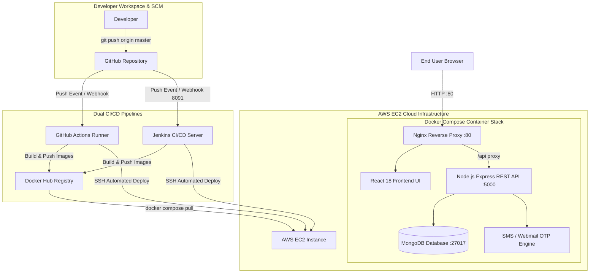

# 🎬 Netflix Full-Stack Application & Dual CI/CD DevOps Pipeline

A production-grade, full-stack **Netflix Clone** built for **DevOps Engineering & Cloud Architecture Practice**. This repository features multi-stage Docker containerization, AWS EC2 Cloud Deployment, and a **Dual CI/CD Pipeline Architecture** running **Jenkins** (with Webhooks) and **GitHub Actions** in parallel.

---

## 🏗️ System Architecture



---

## 🛠️ Technology Stack & Core Features

### **Frontend & UI**
* **Framework:** React 18, Vite, Vanilla CSS Design System.
* **UI Features:** Netflix Dark Theme, Glassmorphism, dynamic movie catalog, responsive navigation, live password strength checker, numeric-only mobile validation.
* **Web Server:** Nginx (serving static production build & reverse-proxying `/api` requests to Express backend).

### **Backend & Authentication**
* **Runtime:** Node.js, Express.js REST API.
* **Authentication:** JWT (JSON Web Tokens), bcrypt password encryption.
* **OTP Engine:** Dynamic SMS dispatch (Fast2SMS / Twilio) with fallback to virtual webmail preview.
* **Database:** MongoDB persistence for Users, Movies, and Watchlists.

### **DevOps & Cloud Infrastructure**
* **Containerization:** Multi-stage `Dockerfile` builds for optimized lightweight images (`node:18-alpine`, `nginx:alpine`).
* **Orchestration:** `docker-compose.yml` coordinating MongoDB, Express Backend, and Nginx Frontend.
* **Cloud Hosting:** AWS EC2 Instance (Amazon Linux 2023 / Ubuntu Server).

---

## 🔄 Dual CI/CD Pipeline Setup

This project features **two independent CI/CD pipelines** working simultaneously:

### 1. 🤖 GitHub Actions Pipeline (`.github/workflows/deploy.yml`)
* Triggers automatically on `git push origin master`.
* Logins to Docker Hub, builds multi-stage images, and pushes tags (`latest` & build numbers).
* Executes secure SSH deployment to AWS EC2 using `appleboy/ssh-action@v1.0.3`.

### 2. 🔴 Jenkins Pipeline (`Jenkinsfile`)
* Declarative Jenkins Pipeline executing inside a Dockerized Jenkins instance.
* Integrated with **GitHub Webhooks** (`http://<EC2-IP>:8091/github-webhook/`) for instant triggering on git push.
* Manages credential security via Jenkins Credential Store (`dockerhub_cred` and `ec2-ssh-key`).

---

## 🚀 Quick Start Guide

### 1. Local Development (Without Docker)

#### Backend Setup
```bash
cd backend
npm install
npm run seed     # Seed database with sample movie catalog & demo user
npm start        # Starts Express server on http://localhost:5000
```

#### Frontend Setup
```bash
cd frontend
npm install
npm run dev      # Starts Vite dev server on http://localhost:3000
```

#### 🔑 Demo Credentials
* **Email:** `devops@netflix.com`
* **Password:** `devops123`

---

### 2. Local Container Deployment (Docker Compose)

Spin up the entire application stack (MongoDB + Backend + Frontend/Nginx) with one command:

```bash
docker compose up --build -d
```

#### Verification
* **Frontend Application:** `http://localhost:80` or `http://localhost:8080`
* **Backend Health Check:** `http://localhost:5000/api/health`
* **Check Container Status:** `docker compose ps`

---

## 🌐 AWS EC2 Cloud Deployment Guide

### Prerequisites & Security Group Rules

Ensure your AWS EC2 Instance Security Group has the following **Inbound Rules**:

| Type | Protocol | Port Range | Source | Purpose |
|---|---|---|---|---|
| **HTTP** | TCP | `80` | `0.0.0.0/0` | Public Web App Access |
| **SSH** | TCP | `22` | `0.0.0.0/0` | Remote Terminal & CI/CD Deployment |
| **Custom TCP** | TCP | `5000` | `0.0.0.0/0` | Express REST API |
| **Custom TCP** | TCP | `8091` | `0.0.0.0/0` | Jenkins Dashboard & Webhook Endpoint |

### Deploying via Docker Compose on EC2

```bash
# SSH into EC2
ssh -i your-key.pem ubuntu@<EC2-PUBLIC-IP>

# Clone repository
git clone https://github.com/SathiyananthPeriyasamy/Netflix-clone-project.git
cd Netflix-clone-project

# Launch stack
sudo docker compose up -d --build
```

---

## 📂 Project Directory Structure

```text
Netflix-clone-project/
├── .github/
│   └── workflows/
│       └── deploy.yml          # GitHub Actions CI/CD Pipeline Definition
├── backend/
│   ├── src/                    # Controllers, Models, Routes & Services
│   │   ├── config/             # DB & OTP Configurations
│   │   ├── controllers/        # Auth & Movie Business Logic
│   │   └── server.js           # Express App Entrypoint
│   ├── Dockerfile              # Node 18 Alpine Production Dockerfile
│   └── package.json
├── frontend/
│   ├── src/                    # React UI Components & Styling
│   ├── nginx.conf              # Nginx Reverse Proxy Config (/api -> backend:5000)
│   ├── Dockerfile              # Multi-Stage Dockerfile (Build React -> Serve Nginx)
│   └── package.json
├── docker-compose.yml          # Container Orchestration Specification
├── Jenkinsfile                 # Declarative Jenkins CI/CD Pipeline Script
└── README.md                   # Project Documentation
```

---

## 🧪 SRE & Troubleshooting Commands

```bash
# View aggregated real-time logs across all containers
sudo docker compose logs -f

# View backend container logs only
sudo docker compose logs -f backend

# Fix Docker permission issue inside Jenkins container
sudo docker exec -u 0 jenkins chmod 666 /var/run/docker.sock

# Restart container stack
sudo docker compose down && sudo docker compose up -d
```

---

## 📄 License & Credits
Built for educational, portfolio, and DevOps practice purposes. All movie metadata powered by TMDB standards.
